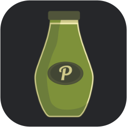
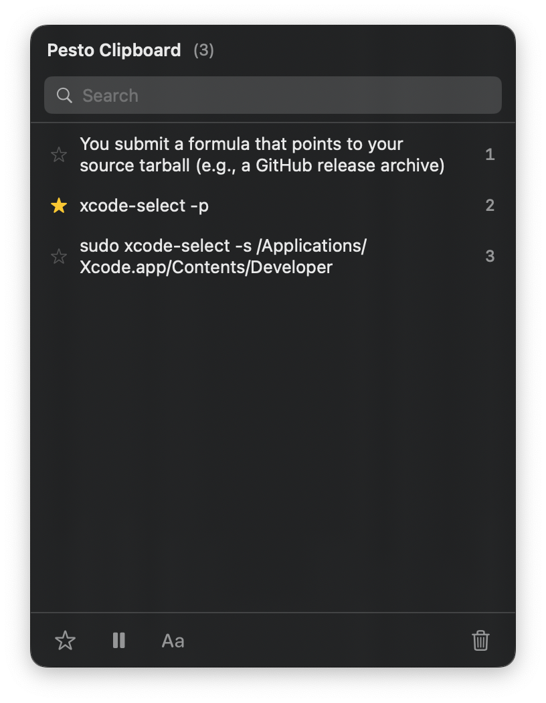

# Pesto Clipboard



Fresh, free, and open-source clipboard management.

**Website:** [pestoclipboard.com](https://pestoclipboard.com)

## Features

- **Menu Bar App**: Lives in your menu bar, out of the way
- **Clipboard History**: Stores 500+ clipboard items (text, images, files)
- **Search**: Quickly filter your clipboard history
- **Global Hotkey**: Open history with Cmd+Shift+V (customizable)
- **Plaintext Paste**: Strip formatting when pasting
- **Launch at Login**: Start automatically when you log in

## Screenshot



## Requirements

- macOS 14.0 (Sonoma) or later

## Installation

### Homebrew (Coming Soon)

```bash
brew install --cask pesto-clipboard
```

### Manual Installation

1. Download the latest release from GitHub Releases
2. Drag `Pesto Clipboard.app` to your Applications folder
3. Launch the app

## Building from Source

### Prerequisites

- Xcode 15.0 or later
- macOS 14.0 or later

### Steps

1. Clone the repository:
   ```bash
   git clone https://github.com/yourusername/pesto-clipboard.git
   cd pesto-clipboard
   ```

2. Open Xcode and create a new macOS App project:
   - Product Name: `PestoClipboard`
   - Team: Your development team
   - Organization Identifier: `com.yourname`
   - Interface: SwiftUI
   - Language: Swift
   - Storage: None (we use programmatic Core Data)

3. Add the source files from `PestoClipboard/` to your Xcode project

4. Add the KeyboardShortcuts package:
   - File > Add Package Dependencies
   - Enter: `https://github.com/sindresorhus/KeyboardShortcuts`
   - Add to target: PestoClipboard

5. Configure the project:
   - Set deployment target to macOS 14.0
   - Add Info.plist entries (see `PestoClipboard/App/Info.plist`)
   - Ensure `LSUIElement = YES` for menu bar only app

6. Build and run!

## Keyboard Shortcuts

| Shortcut | Action |
|----------|--------|
| Cmd+Shift+V | Open clipboard history |
| 1-9 | Quick paste item by number |
| Up/Down | Navigate history |
| Return | Paste selected item |
| Shift+Return | Paste as plain text |
| Delete | Delete selected item |

## Data Storage & Privacy

Clipboard history is stored in a Core Data SQLite database at:

```
~/Library/Application Support/PestoClipboard/
```

**Security:** The app runs in a macOS sandbox, so other sandboxed apps cannot access your clipboard history. Data is not encrypted at the app level — we rely on macOS FileVault (full-disk encryption) for data-at-rest protection, which is enabled by default on most Macs.

**App Exclusions:** You can exclude specific apps from clipboard monitoring in Preferences. Common password managers (1Password, Bitwarden, etc.) are excluded by default.

To forcefully delete all clipboard history, quit the app and run:

```bash
rm -rf ~/Library/Application\ Support/PestoClipboard/
```

## License

MIT License - see LICENSE file for details.

## Acknowledgments

- Inspired by [Maccy](https://maccy.app) and [Copy 'Em](https://apprywhere.com/ce-mac.html)
- [KeyboardShortcuts](https://github.com/sindresorhus/KeyboardShortcuts) by Sindre Sorhus
