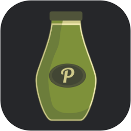
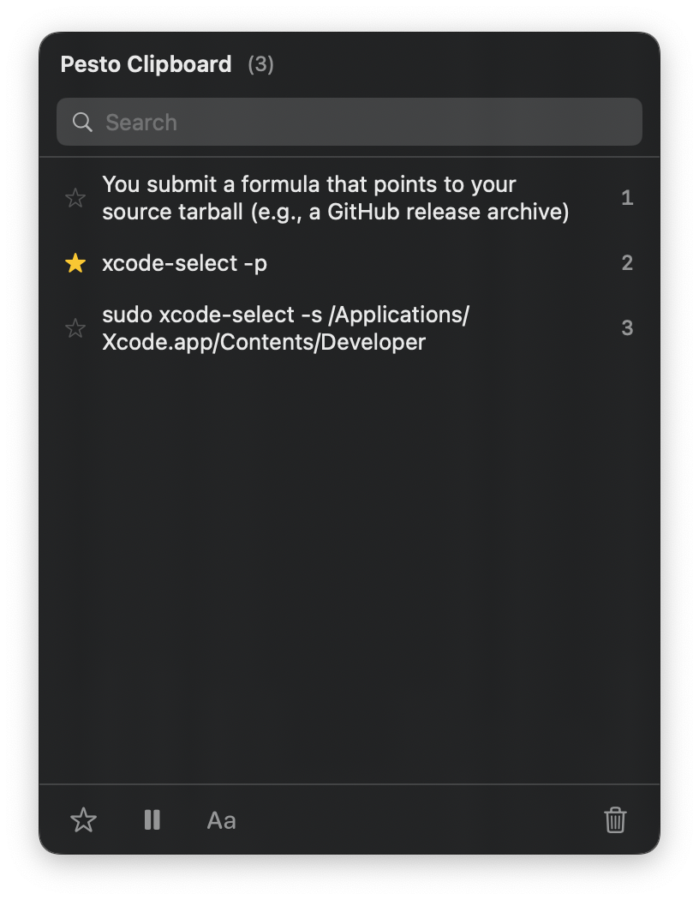

# Pesto Clipboard



Fresh, free, and open-source clipboard management.

**Website:** [pestoclipboard.com](https://pestoclipboard.com)

## Features

- **Menu Bar App**: Lives in your menu bar, out of the way
- **Clipboard History**: Stores 500+ clipboard items (text, images, files)
- **Search**: Quickly filter your clipboard history
- **Global Hotkey**: Open history with Cmd+Shift+V (customizable)
- **Plaintext Paste**: Strip formatting when pasting
- **Launch at Login**: Start automatically when you log in

## Screenshot



## Requirements

- macOS 14.0 (Sonoma) or later

## Installation

### Homebrew

```bash
brew install matthewpick/pesto-clipboard/pesto-clipboard
```

### Manual Download

1. Download the latest `.dmg` from [GitHub Releases](https://github.com/matthewpick/pesto-clipboard/releases)
2. Open the DMG and drag Pesto Clipboard to Applications
3. Launch from Applications

## Building from Source

### Prerequisites

- Xcode 15.0 or later
- macOS 14.0 or later
- [XcodeGen](https://github.com/yonaskolb/xcodegen) — `brew install xcodegen`

The Xcode project is generated from `PestoClipboard/project.yml` by XcodeGen and is
**not** checked into the repo, so you generate it before building. The
KeyboardShortcuts package and all build settings (bundle id, entitlements, Info.plist,
deployment target) are defined in `project.yml` — edit that, not the generated
`.xcodeproj`.

### Steps

1. Clone the repository:
   ```bash
   git clone https://github.com/matthewpick/pesto-clipboard.git
   cd pesto-clipboard
   ```

2. Generate the Xcode project:
   ```bash
   make generate
   # or directly: xcodegen generate --spec PestoClipboard/project.yml
   ```

3. Build and run:
   ```bash
   make build-debug   # build with xcodebuild
   make test          # run the test suite
   ```
   Or open the generated project in Xcode:
   ```bash
   open PestoClipboard/PestoClipboard.xcodeproj
   ```

> The Makefile build/test targets run `make generate` automatically, so a clean
> checkout builds in one step.

## Keyboard Shortcuts

| Shortcut | Action |
|----------|--------|
| Cmd+Shift+V | Open clipboard history |
| 1-9 | Quick paste item by number |
| Up/Down | Navigate history |
| Return | Paste selected item |
| Shift+Return | Paste as plain text |
| Delete | Delete selected item |

## Data Storage & Privacy

Clipboard history is stored in a Core Data SQLite database. Because the app is
sandboxed, the database lives inside its container:

```
~/Library/Containers/com.pestoclipboard.PestoClipboard/Data/Library/Application Support/PestoClipboard/
```

**Security:** The app runs in a macOS sandbox, so other sandboxed apps cannot access your clipboard history. Data is not encrypted at the app level — we rely on macOS FileVault (full-disk encryption) for data-at-rest protection, which is enabled by default on most Macs.

**Password managers:** Clipboard content from password managers (1Password, Bitwarden, etc.) is ignored by default, detected via the markers those apps add to the pasteboard. You can toggle this off in Preferences.

To forcefully delete all clipboard history, quit the app and run:

```bash
rm -rf ~/Library/Containers/com.pestoclipboard.PestoClipboard/Data/Library/Application\ Support/PestoClipboard/
```

## License

MIT License - see LICENSE file for details.

## Acknowledgments

- Inspired by [Maccy](https://maccy.app) and [Copy 'Em](https://apprywhere.com/ce-mac.html)
- [KeyboardShortcuts](https://github.com/sindresorhus/KeyboardShortcuts) by Sindre Sorhus
